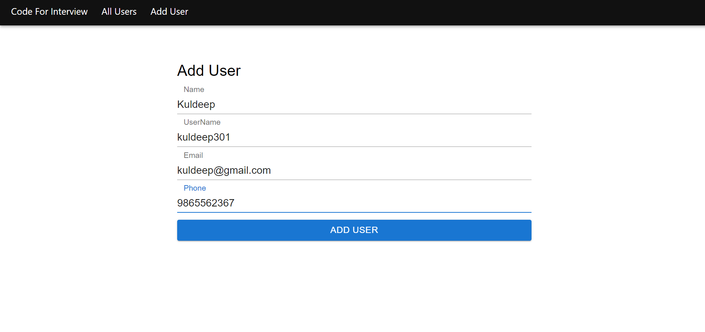
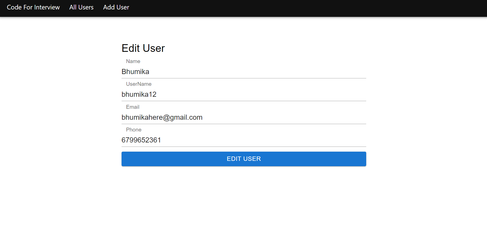
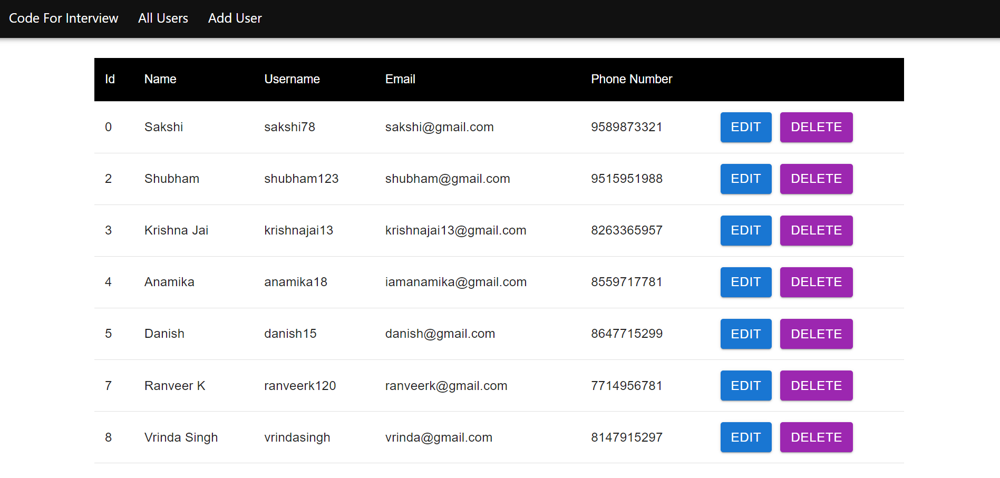

# CRUD application

This is my first project in the world of MERN Technologies, a CRUD Application built using MongoDB, React, Node.js, Express.js. 


## Overview

This is a CRUD Application. 

CRUD stands for Create, Read, Update and Delete.

This application uses MERN technology to create the application.

MERN stands for MongoDB + Express.js + React + Node.js.

- MongoDB - MongoDB is a NoSQL database where each record is a document comprising of key-value pairs that are similar to JSON objects.

- Express - Express is a Node.js framework for backend. Express helps in designing great web applications and APIs.

- React - React is a JavaScript library that is used for building user interfaces. It is used for frontend.

- Node.js - Node.js provides a JavaScript Runtime Environment which allows the user to run their code on the server.

For more information, you may refer to - 
https://www.geeksforgeeks.org/mern-stack/

## Codes And Additionals

This is a simple step-by-step synopsis of the codes.

First we create the React App.

```bash
  npx-create-react-app client
```

Next inside the Client directory,

```bash
  npm start
```

This command runs your application in a local environment.

I have created some components in the src folder which we perform the major tasks.

For the CSS Part, I have used MaterialUI. Appbar and Toolbar are the required components to be added.

For installing MaterialUI, Run the following command

```bash
  npm install @mui/material @emotion/react @emotion/styled
```

Next, Routing is added in the project. For using routing in React install the package using 

```bash
  npm i react-router-dom
```

Next, we have to add a form in the AddUser Component. For that MaterialUI comes to the rescue again. We Use
input fields and buttonss to create our form. Some, extra CSS also needs to be added here.

All the API part has been handled separately in the service section. Axios library is used.

For installing axios, run : 

```bash
  npm i axios
```

The backend part is written in the server folder.
First we will need an empty package.json for installation of other packages. For that we need to run 

```bash
  npm init
```

After the completion, we will create an express server. Run :
```bash
  npm i express
```

We will run our backend js file as a script. Edit the script section as 
```bash
  "start" : "node index.js", 
```

The go to the server folder and run 

```bash
  npm start
```

Next, I have set up a MongoDB Database.

Then, I will install Mongoose. Mongoose Library is used to connect MongoDB Database to the Express Server.

For that, I run the command :

```bash
  npm i mongoose
```

Also, I have kept passwords and other sensitive data in a dotenv file.

Additionally, 'cors' needs to be installed in the server directory.

Since, the user id is unique, i have used it for selection of the user in the Update component.

In this project, we also require params to fetch user id from the URL.


## Screenshots

- Add User



- Edit User



- All Users




## Acknowledgements

I would like to say thanks to the following, for making the process hassle-free.

 - [Code For Interview](https://www.youtube.com/@codeforinterview) Youtube Channel.
 - [Geeks For Geeks](https://www.geeksforgeeks.org/mern-stack/)
 - [Stack Overflow](https://stackoverflow.com/)

